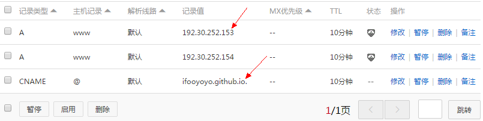

## 前言
一直想有个自己的网站，也一直没有真正弄一个，这次终于动手了。以前以为简单，真正动起手来才发现有一定的复杂性。当搭建好之后，才发现其实真的简单——很多事情其实都是这样。借一句话自勉——世上无难事只怕有心人。感谢很多给予过帮助的陌生人。

## 第一步：购买域名
注意，这里借助的是github的免费服务搭建的个人博客。如果有必要，可以自己买主机（比如亚马逊的VPS，搬瓦工。国内的阿里云等）。此教程不提供自己买主机搭建的方法，请自行谷歌百度搜索方法。

赶上促销。所以在国内万网购买，国内购买麻烦的一点就是要填备案信息。也可以上godaddy购买，据说全世界三分之一的域名都出自godaddy。买之前可以搜索一下优惠码，可以省下一笔钱。

## 第二步：配置DNS解析

出问题最多的就是这里了，虽然参考了教程，教程说的也比较清楚了，但是还是要注意一些细节。

登录[阿里云管理控制台](https://home.console.aliyun.com/#/),进入域名管理,按如下修改：

关于CNAME记录和A记录，管理控制台也解释的比较详细，简单来说CNAME记录可以将你的域名转到另一个域名。A记录将你的域名指向一个IP地址。
这里注意CNAME记录的记录值为`ifooyoyo.github.io.`记住后面还有一个`.`。
## 第三步：选择模板
假定已经有github知识基础，如果没有，可以参见后话里的资料，那里介绍的很详细。本博客的就是采用[github](cnfeat.github.io)上的模板，感谢。具体做法是fork下该仓库，修改仓库名为`你的用户名.github.io`，比如我的就是`ifooyoyo.github.io`。然后修改仓库文件CNMAE为你的网址，比如我的修改为`fooyoyo.cc`。此时浏览器打开你的域名，操作没问题的话就到你的首页了，有没有小激动。

这是我的成功之后的。

## 后话
参考资料：[如何搭建一个独立博客](http://cnfeat.com/blog/2014/05/10/how-to-build-a-blog/)

搭建过程还是学到不少东西的，比如DNS，不管怎样，总而言之言而总之一言以蔽之，博客还是搭建起来了，万事开头难，坚持就是胜利。

